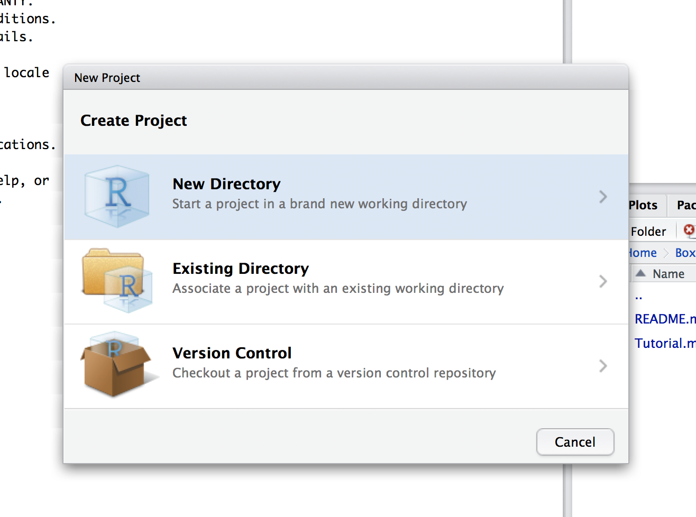
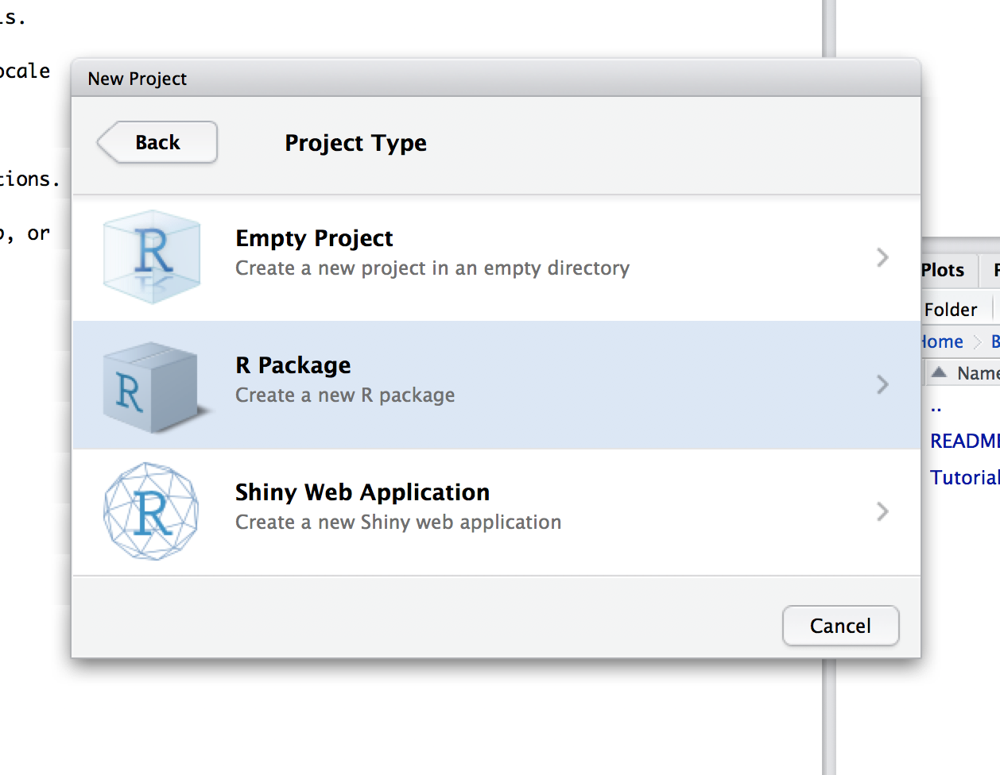
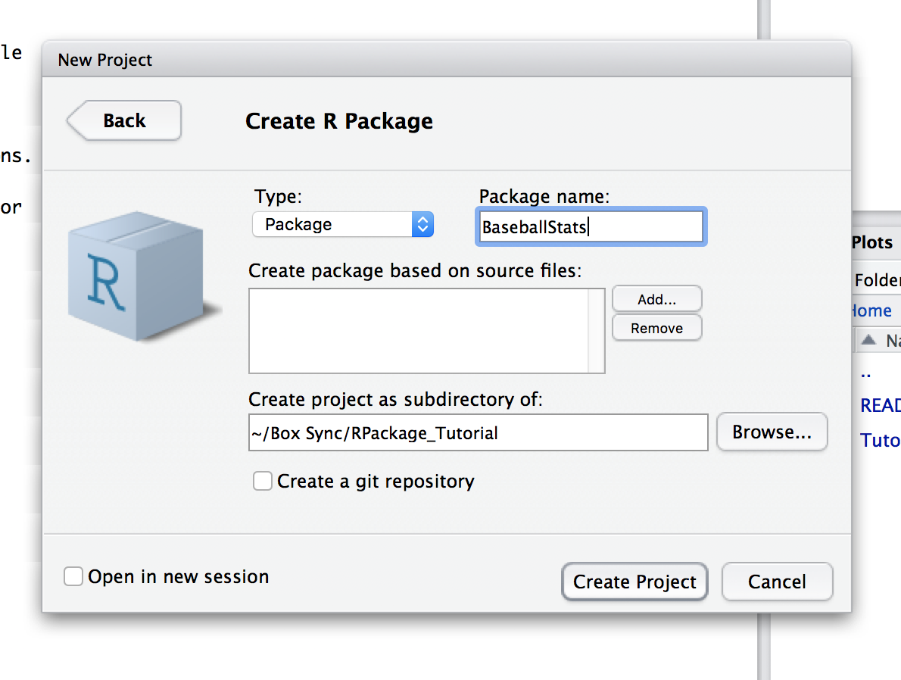
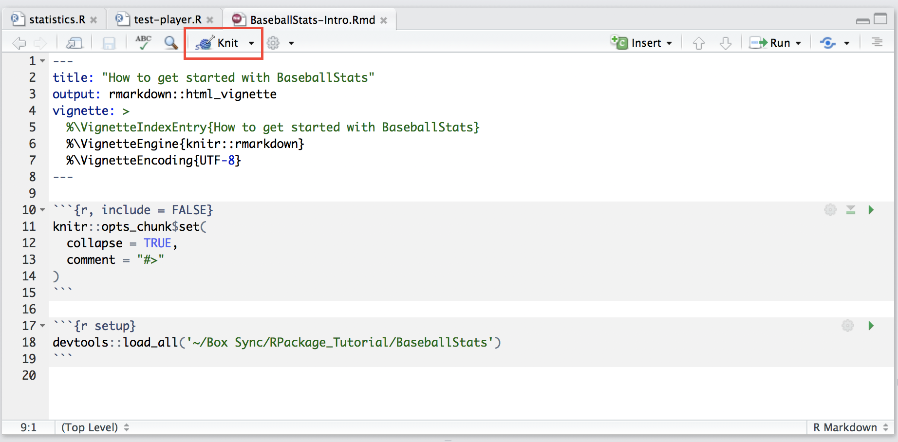

# Introducing R packages

### Why consider creating an R package? 

R is a high-level langauge, popular for running statistical analyses and short data-processing scripts. 

While most users use R with one-off scripts, there are several reasons for creating an R package, including:

1. It is easier to dissemminate your code (for example, if you were publishing your code along with your paper - e.g. https://github.com/chris-mcginnis-ucsf/MULTI-seq).
2. It may be easier for a user to collate standard analyses into functions in a common interface. (e.g. https://github.com/YosefLab/VISION)
3. It is easier to version-control a pakcage than individual scripts. 

### Preliminaries

Before we get started, you'll want to make sure you have the following pieces of software installed:

1. R: https://www.r-project.org/ 
    - The latest R version is 3.6.1 (as of 2019-10-16), though if you have an earlier version that should be fine. 
2. Rstudio: https://rstudio.com/
   - This is just a nice development environment.
3. The R package `devtools`, which can be done from within R: `install.packages('devtools')`. This is an extremely useful package for everything R-development.
4. The R package `roxygen2` which you can install from github as so: `devtools::install_github('klutometis/roxygen')`. Roxygen will help you generate documentation. 
5. The R package `usethis` which you can install as `install.packages("usethis")`

# The Anatomy of an R Package

R packages range in complexity, but standard packages will have the following items:

1. DESCRIPTION (**required**): this stores package metadata, including its name, version, authors, license, and required or suggested packages.
2. NAMESPACE (**required**): a text file storing information pertaining to which functions you'd like to import from external packages, or export from your own package for users.
3. R/ (**required**): a folder that will store *all* source code for your package.
4. man/ (**required**)*: a folder storing all code documentation (refer to the section below entitled "Creating Documentation")
5. LICENSE (*optional*): a text file storing your license information. 
6. vignettes/ (*optional*): a folder storing R vignettes (i.e. tutorials). These are kind of like static jupyter notebooks that users can follow.
7. data/ (*optional*): a folder that stores any **required** package data. 
8. tests/ (*optional*): a folder storing testing scripts. 

### Instantiating an R package

There are a couple of ways to create R packages. Of course you can do this manually, but we'll create a new package using Rstudio. 

Begin by creating a new projects from `File>New Project`: 


Then select the correct type of project you'd like to start.


Name the project and define where you'd like to put it.


After doing this, you will now have a folder called `BaseballStats` in your working directory, with a folder for putting your code, `R`, a folder for putting any documentation, `man`, as well two files for storing important package metadata, DESCRIPTION and NAMESPACE.


**Alternatives** You can also create R packages with  `devtools::create`, `devtools::pacakge.skeleton`, or with `usethis::create_pacakge`. 

### Add your functions or R scripts to R

The R directory will store all your R code. If you have code already you're trying to package up you can move this over to the R directory. Else, you can begin writing code. For example, we'll add a file called `statistics.R` and add a single function for now:

```R
compute_average <- function(num_hits, num_at_bats) {

    if (num_at_bats < 1) {
        stop("You need at least one at bat for a batting average!")
    }

    return(num_hits / num_at_bats)
}
```

You can make sure that this function is working by loading the package with `devtools` and tesing out your function:

```R
require(devtools)
load_all('.')

compute_average(10, 50)
[1] 0.2
```

### Creating Documentation

Creating documentation in R with Roxygen is extremely easy. Roxygen will take your comments beginning with a `#'` character before every function and automatically generate documention. For example, using our function from before we can add the following documentation:

```R
#' A function for computing a batter's average.
#' 
#' This function takes in the number of at-bats and number of hits and will return an average.
#' @param num_hits Number of hits
#' @param num_at_bats Number of at bats
#' @return The batting average.

#' @examples
#' compute_average(10, 50)
compute_average <- function(num_hits, num_at_bats) {

    if (num_at_bats < 1) {
        stop("You need at least one at bat for a batting average!")
    }

    return(num_hits / num_at_bats)
}
```

Using the function `devtools::document` will populate the `man/` directory with your documentation. After running this function, you should notice two new `.Rd` files in your `man/` directory: `BaseballStats-package.Rd` and `compute_average.Rd`. 

After running the function `devtools::document`, you can see your new documentation with the call `?compute_average`.

# Object Oriented Programming In R

For more advanced packages, you may want to develop from an object oriented (OO) perspective. Such an approach could be nice for wrapping up data (e.g. a gene expression matrix) or the parameters around an analysis to replicate downstream (e.g. the filtered gene list, normalization method, etc.).

R supports three different object oriented programming paradigms: S3, S4, and R5. Here we'll focus on S4 classes which are extremely flexible and similar to other object-oriented systems. 

To begin, we'll creating a file for declaring all classes and what data can be stored in each instance. This will go in the `AllClasses.R` file. 

### Defining S4 Classes

We'll begin by creating two classes: `Player` and `Club`. 

In `AllClasses.R` we'll add the following code: 

```R
setClassUnion('numericORNULL', members=c('numeric', 'NULL'))

Player <- setClass("Player",
                   slots = c(
                     name = "character",
                     num_at_bats = "numericORNULL",
                     num_hits = "numericORNULL",
                     is_pitcher = 'logical',
                     era = 'numericORNULL'),
                   prototype = list(
                     name = character(),
                     num_at_bats = 0,
                     num_hits = 0,
                     is_pitcher = FALSE,
                     era = 0.0
                   ))

Club <- setClass("Club",
                 slots = c(
                   name = 'character',
                   city = 'character',
                   winning_percentage = 'numericORNULL',
                   players = 'list'),
                 prototype = list(
                   name = character(),
                   city = character(),
                   winning_percentage = 0.0,
                   players = list()

                 ))

```
### Creating Class-Specific Functions 

To support classic object-oriented functionality, you might want to create class-specific functions, including a generator function akin to python's `__init__` function. 

For readability, you can create an `.R`. file for each class you have - for instance `methods-Player.R`. We'll add the following code to `methods-Player.R`: 

```R
#' Initialize a new Player object.
#'
#' @param name Name of the player
#' @param num_at_bats Number of at-bats the player has had
#' @param num_hits Number of hits the player has had 
#' @param is_pitcher Boolean indicating whether or not the player pitches
#' @param era The Earned Run Average (ERA) for a pitcher 
#' @return Player object
Player <- function(name = "", num_at_bats = NULL, num_hits = NULL,
        is_pitcher = FALSE, era = NULL) {

    .Object <- new('Player', name = name, num_at_bats = num_at_bats,
                    num_hits = num_hits, is_pitcher = is_pitcher, era = era)

    return(.Object)
}

#' Compute a Player's batting average
#'
#' @param object A Player
#' @return The player's batting average 
setMethod("compute_batting_average", signature(object = "Player"),
            function(object) {

            return(compute_average(object@num_hits, object@num_at_bats))

        })
```

As for the `Club` class we'll add to a file called `methods-Club.R`:

```R
Club <- function(name = "", city = "", winning_percentage = NULL,
        players = list()) {

    .Object <- new('Club', name = name, city = city,
                    winning_percentage = winning_percentage, players = players)

    return(.Object)
}


#' Compute the team's batting average
#'
#' @param object A Club
#' @return The Club's batting average
setMethod("compute_batting_average", signature(object = "Club"),
            function(object) {
            
            num_hits = sum(sapply(object@players, function(x) x@num_hits))
            num_at_bats = sum(sapply(object@players, function(x) x@num_at_bats))

            return(compute_average(num_hits, num_at_bats))

        })
```

You may notice that both objects have a function called `compute_batting_average`. This takes advantage of R's multiple dispatching feature, meaning that it will look for the object's "signature" before calling the function. In order to take advantage of this, we'll need to create one more file in `R/` that will store these **generics** that support multiple dispatch: `AllGenerics.R`. We'll add a single generic for now to `AllGenerics.R`:

```R
setGeneric("compute_batting_average", function(object, ...) {
    standardGeneric("compute_batting_average")
})

```

Now we can get this functionality:

```R
devtools::load_all()

p1 = Player('Babe Ruth', num_hits = 1000, num_at_bats = 2000)
p2 = Player('Joe Dimaggio', num_hits = 3000, num_at_bats = 5000)

yankees = Club(name = 'yankees', city='New York', players = list(p1, p2))

compute_batting_average(p1)
[1] 0.5

compute_batting_average(yankees)
[1] 0.5714286
```

# Testing Your Package

A great practice in creating your R packages is to add testing functionality. This will allows users to make sure that they've installed your package correctly, as well as help you notice any functionality you may have broken in an update to the package. 

For this purpose, I recommend the `testthat` package. To get started, we'll first use the package `usethis` to create our testing environment. As a note, `usethis` has a ton of other great functionality for adding structure to your package, but for now we'll use it to introduce unit tests. 

We'll add one example test, testing that the batting average of a player is computed correctly:

```R
require(usethis)

use_test("player")
✔ Setting active project to '/Users/student/Box Sync/RPackage_Tutorial/BaseballStats'
✔ Creating 'tests/testthat/'
✔ Writing 'tests/testthat.R'
● Call `use_test()` to initialize a basic test file and open it for editing.
✔ Increasing 'testthat' version to '>= 2.1.0' in DESCRIPTION
✔ Writing 'tests/testthat/test-player-test.R'
● Modify 'tests/testthat/test-player-test.R'
```

You'll now notice that a window pops up to edit the new test file that you've added. You can add the following test:

```R
test_that("player batting average works", {
  p1 = Player('joe', num_hits= 100, num_at_bats = 500)
  expect_equal(compute_batting_average(p1), 0.2)
})
```

You can make sure your tests work by using `devtools::test()`. 

# Publishing Your Code

Before publishing your code, you'll want to update your DESCRIPTION and NAMESPACE, as well as add README to your package. 

As noted before the DESCRIPTION will provide information related to the authors of the package, license, as well as any dependencies. 

The NAMESPACE will let your package installer know which functions you'd like to make available from your package (by exporting them) and which functions you'd like to use from your dependencies (by importing them). 

The README will provide the user with any more information about the package (similar to a github's README). 

A good DESCRIPTION will look something like this: 

```R
Package: BaseballStats
Type: Package
Title: A package for computing statistics for baseball players
Version: 1.0
Date: 2019-10-14
Authors@R: c(person("Matt", "Jones", email = "mattjones315@gmail.com", role = c("aut", "cre")))
Maintainer: Matt Jones <matts_email@email.com>
Description: BaseballStats provides an interface for storing player & ball club information as well as computing statistics around these items.
License: MIT
RoxygenNote: 6.1.1
Suggests:
	knitr,
	rmarkdown,
    testthat,
    ggplot2
```

For now, you can leave the NAMESPACE as is, exporting all functions. 

Also to note is that you can provide a license (e.g. MIT) by using the `usethis` package -- for example `usethis::use_mit_license("Matt Jones")`. This will add to your DESCRIPTOIN file as well as create a new LICENSE file for your pacakge.

To make sure that everything works correctly, you can run `R CMD check .` via command line from within your package directory. 

### Publishing on Github

The easiest way to publish your R package is on github. This can be done simply by creating a repository for your code (e.g. https://github.com/mattjones315/BaseballStats). Users then can install your package with devtools using `devtools::install_github('mattjones315/BaseballStats`), for example. 

This can be really nice for making your code available while it's under development. 

### Publishing with CRAN

CRAN is the default package server for R, and requires a bit more information before publishing. Firstly, you'll want to update your README.md and create a new file called NEWS.md in the package home directory that details any new updates for each version bump. You can look at the NEWS.md of [one of our recent packages](https://github.com/YosefLab/VISION/blob/master/NEWS.md). 

You'll next want to use the command line function `R CMD check .` to run, document, and test your code base. 

Now, to submit your package to CRAN you need to build the package using `devtools::build()` (which will create a package bundle) and then manually upload this to http://cran.r-project.org/submit.html. These submission are vetted by volunteers and Hadley Wickam has some great advice around the entire submssion process, namely with how to make these gatekeepers look favorably on your package: http://r-pkgs.had.co.nz/release.html.

### Publishing with Bioconductor 

Lastly, for specifically biology-related packages you can submit to Bioconductor to be hosted on their specific servers. This process tends to be a bit more rigorous but looks similar to a CRAN submssion. The full process can be found [here](https://www.bioconductor.org/developers/package-submission/).


# Extra Topics

## Vignettes

Vignettes are crucial parts of any R package, and primarily serve as an introduction to your package or as a tutorial for new features. To start your first vignette, I recommend using the `usethis::use_vignette`:

```R
require(usethis)
use_vignette('BaseballStats-Intro', 'How to get started with BaseballStats')
```

If you're in Rstudio, this will automatically open up an Rmarkdown (`.Rmd`) file for you to edit. You'll notice that the key entries are already populated (e.g. the header and setup entries). 

Rmarkdown writes very similarly to regular markdown, with the exception that it is compiled with `knitr` and is meant to have lots of embedded R code.

When you're done with creating your vignette, you can see how it looks by clicking on the `knit` key at the top of your Rstudio screen. 



For a complete style guide, refer to this [webpage](https://rmarkdown.rstudio.com/lesson-1.html)

## Rcpp

R is infamous for slow compute times and poor memory management, the confluence of which may preclude any serious data-scientist from using vanilla R for analyses.  

## Creating Better Package Documentation with `pkgdown`

## Shiny apps

